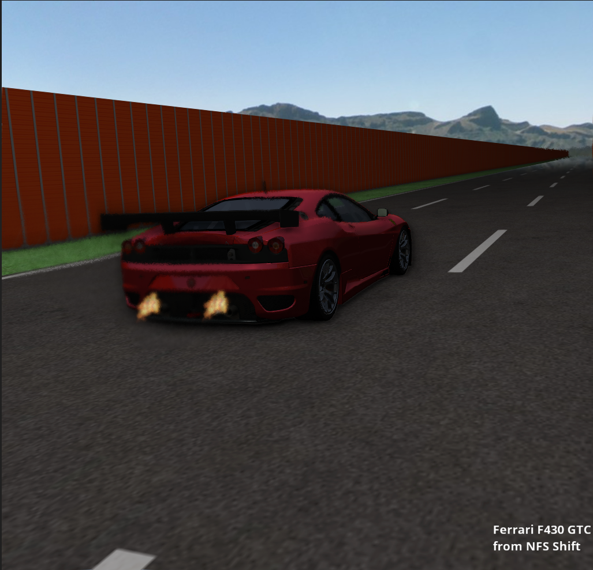

# CGJDemo
## Car related particle effects
Final project for CGJ

Windows build status: 

Linux build status: 

Demo for a simple yet flexible game engine developed for a Computer Graphics for Games course.

The focus of this demo is in particle effects and post-processing effects, mainly the localized heat haze effect.

# Controlls

WSQE - Camera

G - Grab/Release Mouse

F - Move/Stop

N - Day/Night

# Screenshot

